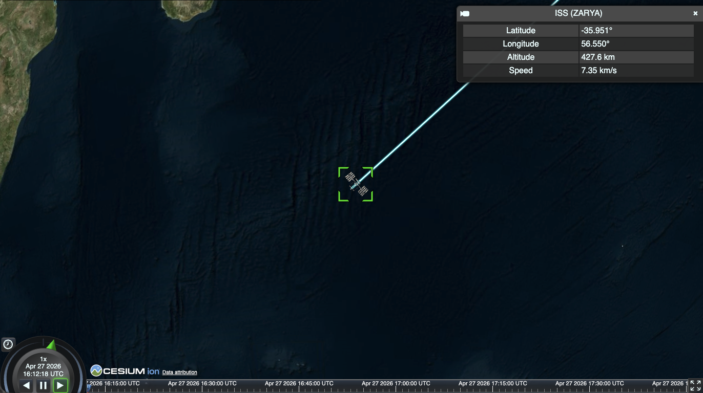

# ISS Live Tracker

A small [CesiumJS](https://cesium.com/platform/cesiumjs/) app that renders a
3D model of the International Space Station orbiting Earth in real time, using
hardcoded TLE data propagated with [satellite.js](https://github.com/shashwatak/satellite.js).



Built as the companion project for the [ISS Live Tracker tutorial](./TUTORIAL.md).

## Stack

- [Vite](https://vitejs.dev/) + [vite-plugin-cesium](https://github.com/CesiumGS/cesium-vite-example)
- [CesiumJS](https://cesium.com/platform/cesiumjs/) 1.122
- [satellite.js](https://github.com/shashwatak/satellite.js) 5 (SGP4 orbit propagation)
- Plain JavaScript ES modules

## Quickstart

```bash
git clone <this-repo>
cd tutorial-satellite-tracker
npm install
cp .env.example .env
# add your Cesium ion token to .env
npm run dev
```

Open the URL Vite prints (usually http://localhost:5173).

### Cesium ion token

Get a free token at [ion.cesium.com/tokens](https://ion.cesium.com/tokens) and
paste it into `.env`:

```
VITE_CESIUM_ION_TOKEN=your_token_here
```

The app will throw a clear error on startup if the token is missing.

### 3D model

The app loads an ISS glTF model from Cesium ion by asset ID. ion assets are
tied to your account, so **you'll need to upload your own model** and plug in
its asset ID.

1. Grab any ISS glTF/glb. This tutorial uses
   [this Polycam capture](https://poly.cam/capture/57e8b6b1-8c2f-4426-8ed4-0ee2e031eef0)
   downloaded as glTF — [Sketchfab](https://sketchfab.com/) and
   [NASA 3D Resources](https://nasa3d.arc.nasa.gov/) have more options.
2. Drag and drop the file onto [ion.cesium.com](https://ion.cesium.com/) → **My Assets**.
3. Once it finishes tiling, copy the **Asset ID**.
4. Paste it into `ISS_ION_ASSET_ID` in [src/main.js](src/main.js#L76).

## Scripts

```bash
npm run dev       # start local dev server with HMR
npm run build     # production build -> dist/
npm run preview   # preview the production build
```

## Project layout

```
src/
  main.js    # Cesium Viewer setup, entity, camera, info box
  iss.js     # hardcoded ISS TLE + SGP4 propagation helper
  style.css  # full-window viewer
steps/       # per-tutorial-step snapshots
tutorial-assets/  # screenshots used by TUTORIAL.md
TUTORIAL.md
```

## Refreshing the TLE

The ISS TLE in [src/iss.js](src/iss.js) drifts ~1–2 km/day from reality.
That's imperceptible on a 3D globe, but if you want the real current position,
grab a fresh TLE for NORAD ID 25544 from
[CelesTrak](https://celestrak.org/NORAD/elements/gp.php?CATNR=25544&FORMAT=TLE)
and paste the two lines into `ISS_TLE`.

## Deploy

The `dist/` folder is fully static and can be hosted anywhere (GitHub Pages,
Netlify, Cloudflare Pages, S3, etc.). Make sure `VITE_CESIUM_ION_TOKEN` is set
at build time.

## License

MIT
