# Build an ISS Live Tracker with CesiumJS

In this tutorial you'll build a small web app that renders the International
Space Station orbiting Earth in real time — orbit path, 3D model, live
telemetry, and playback controls — all with [CesiumJS](https://cesium.com/platform/cesiumjs/).

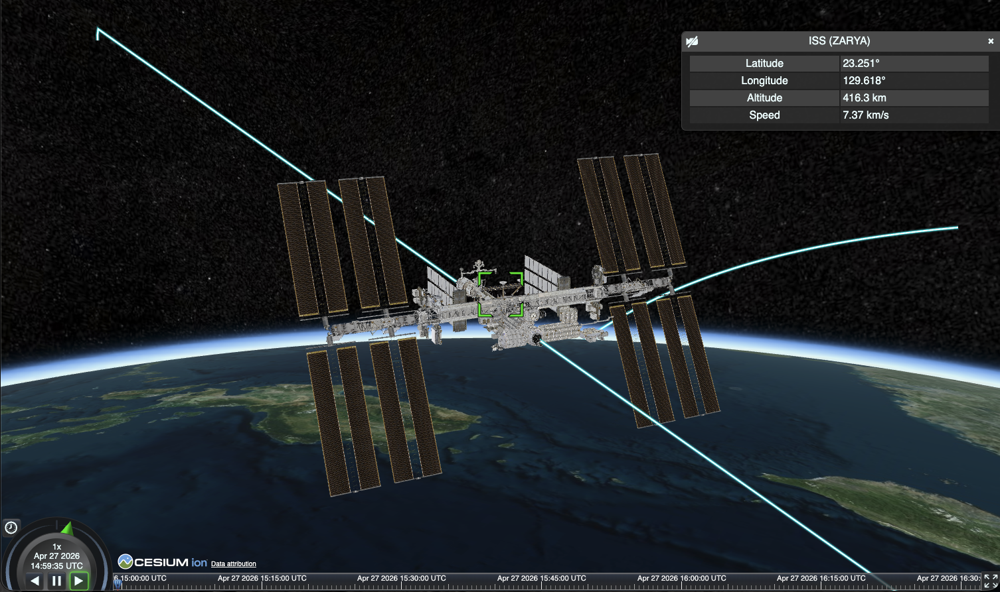

**You'll learn how to:**

- Scaffold a CesiumJS project with Vite
- Load a glTF 3D model from Cesium ion
- Drive an entity with a time-varying position (`SampledPositionProperty`)
- Draw an orbit path and use Cesium's built-in clock/timeline
- Populate the info box with live, frame-updating data

**Prerequisites:** Node.js 18+, a code editor, basic JavaScript, a free
[Cesium ion](https://ion.cesium.com/) account.

**Time:** ~30 minutes.

The finished code is in this repo. Each part has a matching snapshot under
[`steps/`](./steps) if you want to skip ahead or compare.

---

## Part 1 — Scaffold the project

We'll use Vite with the official `vite-plugin-cesium`, which wires up the
Cesium static assets (workers, widgets CSS, assets) for you.

Create a project folder and install dependencies:

```bash
mkdir iss-tracker && cd iss-tracker
npm init -y
npm install cesium satellite.js
npm install -D vite vite-plugin-cesium
```

Set `"type": "module"` and add scripts to `package.json`:

```json
{
  "type": "module",
  "scripts": {
    "dev": "vite",
    "build": "vite build",
    "preview": "vite preview"
  }
}
```

Create **`vite.config.js`**:

```js
import { defineConfig } from 'vite';
import cesium from 'vite-plugin-cesium';

export default defineConfig({
  plugins: [cesium()],
  // Allow top-level await.
  build: { target: 'esnext' },
});
```

Create **`index.html`**:

```html
<!doctype html>
<html lang="en">
  <head>
    <meta charset="UTF-8" />
    <title>ISS Live Tracker</title>
  </head>
  <body>
    <div id="cesiumContainer"></div>
    <script type="module" src="/src/main.js"></script>
  </body>
</html>
```

Create **`src/style.css`** so the viewer fills the window:

```css
html, body, #cesiumContainer {
  width: 100%;
  height: 100%;
  margin: 0;
  padding: 0;
  overflow: hidden;
}
```

### Cesium ion token

Go to [ion.cesium.com/tokens](https://ion.cesium.com/tokens), copy your default
token, and create **`.env`**:

```
VITE_CESIUM_ION_TOKEN=your_token_here
```

Also add a **`.env.example`** (commit this) and add `.env` to `.gitignore`.

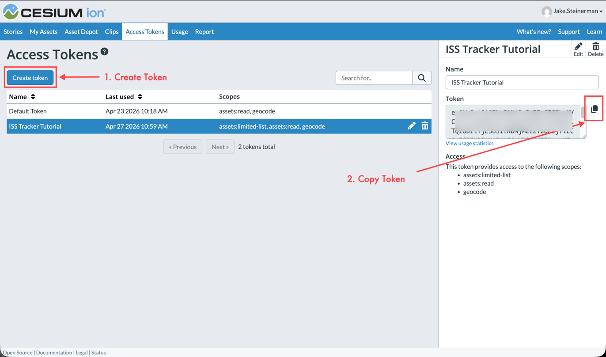

> **Why the `VITE_` prefix?** Vite only exposes env vars prefixed with `VITE_`
> to your client code via `import.meta.env`.

Run it:

```bash
npm run dev
```

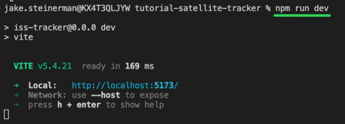

You'll get a blank page for now — that's expected. Next part we bring up the
globe.

---

## Part 2 — Hello, globe

Create **`src/main.js`**:

```js
import { Ion, Viewer } from 'cesium';
import 'cesium/Build/Cesium/Widgets/widgets.css';
import './style.css';

const token = import.meta.env.VITE_CESIUM_ION_TOKEN;
if (!token || token === 'your_token_here') {
  throw new Error(
    'Missing VITE_CESIUM_ION_TOKEN. Copy .env.example to .env and add your token.'
  );
}
Ion.defaultAccessToken = token;

const viewer = new Viewer('cesiumContainer', {
  baseLayerPicker: false,
  geocoder: false,
  sceneModePicker: false,
  navigationHelpButton: false,
  homeButton: false,
});
```

Reload. You should see Cesium's default tilted view of Earth.

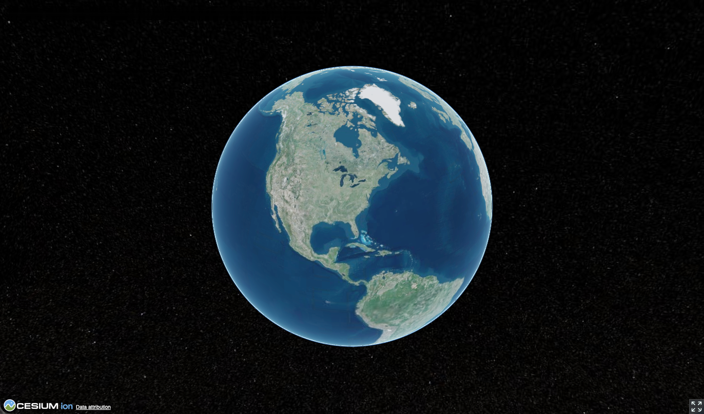

We disabled a few UI widgets that would clutter this demo — the animation
widget and timeline stay on by default, which we'll use in Part 7.

---

## Part 3 — TLE data

Satellite orbits are published as [Two-Line Element sets](https://en.wikipedia.org/wiki/Two-line_element_set)
(TLEs). Each one describes a satellite's orbit at a specific moment. We'll
hardcode a recent ISS TLE — the orbit drifts ~1–2 km/day from reality, which
is invisible on a globe.

Create **`src/iss.js`**:

```js
import { Cartesian3, JulianDate, SampledPositionProperty } from 'cesium';
import * as satellite from 'satellite.js';

export const ISS_TLE = {
  name: 'ISS (ZARYA)',
  line1: '1 25544U 98067A   26113.61927546  .00009382  00000+0  17870-3 0  9990',
  line2: '2 25544  51.6319 210.1816 0006828 342.1779  17.8969 15.48913482563293',
};
```

> **Refresh later:** Grab the latest from
> [CelesTrak](https://celestrak.org/NORAD/elements/gp.php?CATNR=25544&FORMAT=TLE)
> and paste lines 2 and 3 in.

---

## Part 4 — Propagate the orbit

A TLE by itself is just a snapshot. To get a position at any given time we run
it through the SGP4 propagator (that's what `satellite.js` provides).

Cesium's `SampledPositionProperty` then lets us add (time, position) samples
and interpolates between them automatically.

Add to **`src/iss.js`**:

```js
export function sampleIssOrbit(tle, startTime, durationSeconds, stepSeconds) {
  const satrec = satellite.twoline2satrec(tle.line1, tle.line2);
  const positions = new SampledPositionProperty();

  for (let dt = 0; dt <= durationSeconds; dt += stepSeconds) {
    const time = JulianDate.addSeconds(startTime, dt, new JulianDate());
    const jsDate = JulianDate.toDate(time);

    const eci = satellite.propagate(satrec, jsDate);
    if (!eci.position) continue;

    // Convert Earth-Centered Inertial (non-rotating) to geodetic lat/lon/alt
    // so the position lines up with the rotating globe Cesium renders.
    const gmst = satellite.gstime(jsDate);
    const geo = satellite.eciToGeodetic(eci.position, gmst);

    positions.addSample(
      time,
      Cartesian3.fromRadians(geo.longitude, geo.latitude, geo.height * 1000)
    );
  }

  return positions;
}
```

> **Frame note:** SGP4 returns positions in an ECI frame (doesn't rotate with
> Earth). We convert to geodetic using GMST — otherwise the ISS would appear
> to hover over one point of space instead of orbiting the ground.

Now in **`src/main.js`** import it and sample one orbit (~93 minutes) at 10 s
cadence:

```js
import { JulianDate } from 'cesium';
import { ISS_TLE, sampleIssOrbit } from './iss.js';

const start = JulianDate.now();
const stop = JulianDate.addSeconds(start, 93 * 60, new JulianDate());
const positions = sampleIssOrbit(ISS_TLE, start, 93 * 60, 10);
```

---

## Part 5 — Draw the orbit path

Now we add an **entity** with a time-varying `position` and a `path` graphic.
Cesium draws the path by walking the position property over time.

Add to **`src/main.js`**:

```js
import { Color, PolylineGlowMaterialProperty } from 'cesium';

const iss = viewer.entities.add({
  id: 'iss',
  name: ISS_TLE.name,
  position: positions,
  path: {
    resolution: 120,
    material: new PolylineGlowMaterialProperty({
      glowPower: 0.2,
      color: Color.CYAN,
    }),
    width: 8,
    // Draw the full orbit as a closed loop.
    leadTime: 93 * 60,
    trailTime: 93 * 60,
  },
});

viewer.trackedEntity = iss;
```

Reload and you should see a glowing cyan ring around Earth.

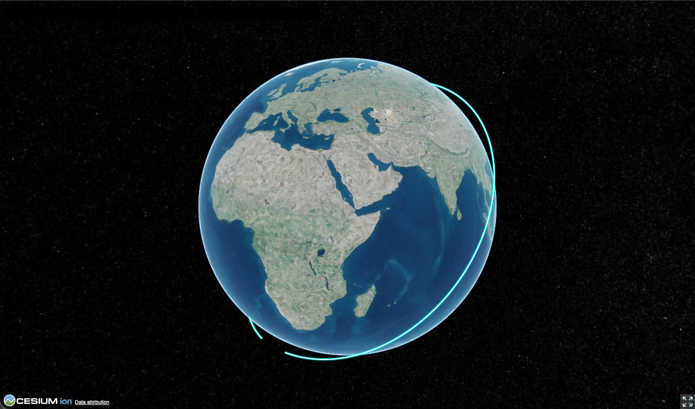

> `leadTime` / `trailTime` control how far into the future/past the path is
> drawn. Setting both to one orbital period draws the full loop continuously.

---

## Part 6 — Add the 3D model

We'll attach a glTF model of the ISS to the entity. Cesium ion hosts glTF
assets with a CDN and a simple `IonResource.fromAssetId()` loader.

### Upload a model to Cesium ion

Grab any ISS glTF/glb you like — [Polycam](https://poly.cam/),
[Sketchfab](https://sketchfab.com/), [NASA 3D Resources](https://nasa3d.arc.nasa.gov/)
all have free options. The one in this tutorial is
[this Polycam capture](https://poly.cam/capture/57e8b6b1-8c2f-4426-8ed4-0ee2e031eef0)
downloaded as glTF.

1. Open [ion.cesium.com](https://ion.cesium.com/) → **My Assets**.

   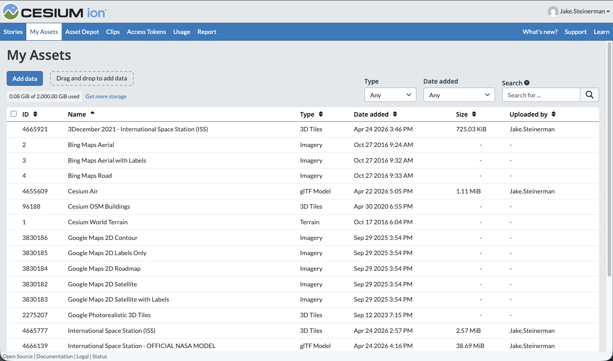

2. Drag and drop your `.gltf` / `.glb` onto the page (or click **Add data** →
   **3D Model**).

   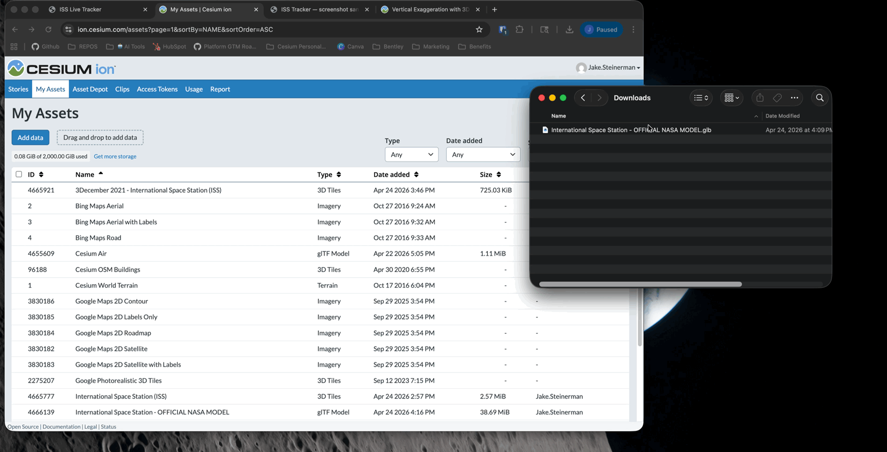

3. Wait for tiling to finish, then open the asset. The **Asset ID** at the
   top of the detail page is the number you need.

   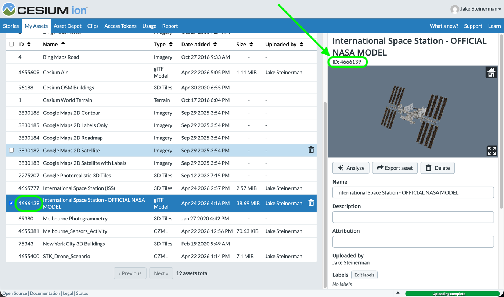

### Load it in the app

Back in **`src/main.js`**, replace the `viewer.trackedEntity = iss` line with
an updated entity that includes a `model` and `orientation`:

```js
import {
  IonResource,
  VelocityOrientationProperty,
} from 'cesium';

const ISS_ION_ASSET_ID = 1234567; // ← replace with your asset ID

const iss = viewer.entities.add({
  id: 'iss',
  name: ISS_TLE.name,
  position: positions,
  orientation: new VelocityOrientationProperty(positions),
  model: {
    uri: await IonResource.fromAssetId(ISS_ION_ASSET_ID),
    minimumPixelSize: 64,
    maximumScale: 20_000,
  },
  path: {
    /* …same as before… */
  },
});
```

`VelocityOrientationProperty` auto-rotates the model so its +X axis points in
the direction of travel — no quaternion math.

`minimumPixelSize: 64` keeps the ISS visible even when the camera is far away,
which is almost always (it's ~400 km up).

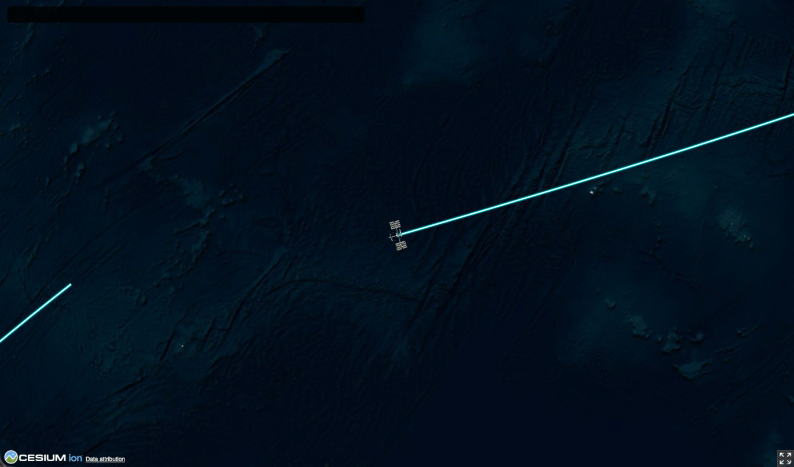

> **Heads-up:** Some third-party glTF models have broken bounding spheres that
> crash `viewer.trackedEntity` or `viewer.flyTo(entity)` with a
> `DeveloperError: normalized result is not a number`. If that happens to
> you, try a different model — or do what we'll do in the next part and move
> the camera manually.

---

## Part 7 — Clock, timeline, and camera

Tell Cesium which time range our samples cover, loop the clock when we hit the
end, and align the timeline to our window:

```js
import { ClockRange } from 'cesium';

viewer.clock.startTime = start.clone();
viewer.clock.stopTime = stop.clone();
viewer.clock.currentTime = start.clone();
viewer.clock.clockRange = ClockRange.LOOP_STOP;
viewer.clock.multiplier = 1; // 1 simulated second per real second
viewer.clock.shouldAnimate = true;

viewer.timeline.zoomTo(start, stop);
```

Then place the camera at a nice vantage point near the ISS (avoiding
`flyTo(entity)` so we don't depend on the model's bounding sphere):

```js
import { Cartesian3 } from 'cesium';

const issStart = iss.position.getValue(start);
viewer.camera.flyTo({
  destination: Cartesian3.multiplyByScalar(issStart, 1.5, new Cartesian3()),
  duration: 0,
});
```

Multiplying the Earth→ISS vector by 1.5 puts us 0.5× the ISS altitude beyond
it, looking toward Earth.

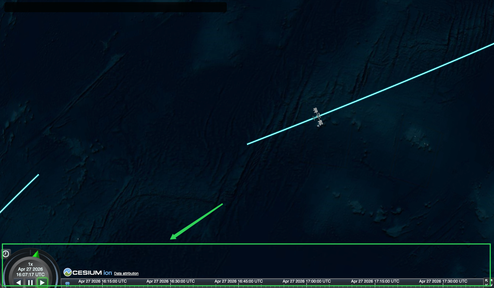

You now have the default Cesium animation widget (bottom-left) and timeline
(bottom). Try bumping the speed up — the ISS does a full orbit in 93 minutes
at 1×, but at 60× you can watch a full pass in about a minute and a half.

> **Tip — get up close to the model:** click the ISS to open the info box,
> then click the small **camera icon** next to its title. Cesium will lock the
> camera onto the entity so you can orbit around the model and see it up
> close as it flies.

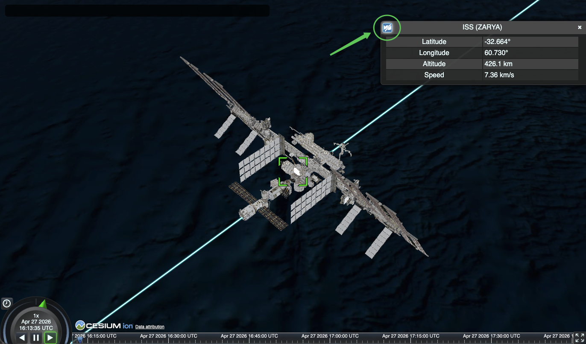

---

## Part 8 — Live info box

Cesium already renders an info box in the top-right whenever an entity is
selected. Its content comes from `entity.description`. Wrap that in a
`CallbackProperty` and Cesium will re-evaluate it every frame — giving us a
live HUD for free.

```js
import { CallbackProperty, Cartographic, Math as CesiumMath } from 'cesium';

const scratchCurrent = new Cartesian3();
const scratchNext = new Cartesian3();
const scratchCarto = new Cartographic();

iss.description = new CallbackProperty((time) => {
  const current = iss.position.getValue(time, scratchCurrent);
  if (!current) return '';

  Cartographic.fromCartesian(current, undefined, scratchCarto);
  const lat = CesiumMath.toDegrees(scratchCarto.latitude).toFixed(3);
  const lon = CesiumMath.toDegrees(scratchCarto.longitude).toFixed(3);
  const altKm = (scratchCarto.height / 1000).toFixed(1);

  // Speed ≈ distance between current and +1 s position.
  const oneSecondLater = JulianDate.addSeconds(time, 1, new JulianDate());
  const next = iss.position.getValue(oneSecondLater, scratchNext);
  const speedKmS = next
    ? (Cartesian3.distance(current, next) / 1000).toFixed(2)
    : '—';

  return `
    <table class="cesium-infoBox-defaultTable">
      <tr><th>Latitude</th><td>${lat}°</td></tr>
      <tr><th>Longitude</th><td>${lon}°</td></tr>
      <tr><th>Altitude</th><td>${altKm} km</td></tr>
      <tr><th>Speed</th><td>${speedKmS} km/s</td></tr>
    </table>
  `;
}, false);

// Open the info box by default.
viewer.selectedEntity = iss;
```

Reload. You should see live lat/lon/altitude/speed in the top-right, updating
as the ISS moves. Speed hovers around 7.66 km/s.


> **Why scratch objects?** The callback runs every frame. Reusing the same
> `Cartesian3` / `Cartographic` instances avoids allocating new ones 60×/sec.
> The `false` second arg tells Cesium this property isn't constant and must be
> re-evaluated.

> **Why `cesium-infoBox-defaultTable`?** It's the built-in CSS class Cesium
> uses for its own info-box tables. Using it makes your content match the
> rest of the widget.

---

## Done

You've got a live ISS tracker with:

- Real orbital mechanics (TLE + SGP4)
- A 3D model hosted on Cesium ion
- Cesium's built-in clock, timeline, and info box
- Live telemetry

### Ideas to extend

- **Multiple satellites.** Fetch a bulk TLE feed (e.g. `active.txt` from
  CelesTrak) and add an entity per sat.
- **Ground station lines.** Draw `Polyline` entities from your location to the
  ISS when it's above the horizon.
- **Tracking camera.** Swap the static camera for
  `viewer.trackedEntity = iss` — as long as your model's bounding sphere is
  sane.

### Deploy

`npm run build` produces a fully static `dist/` folder. Host it anywhere
(GitHub Pages, Netlify, Cloudflare Pages, S3…). Make sure
`VITE_CESIUM_ION_TOKEN` is set at build time, and — for production — create a
scoped ion token (ion → Access Tokens → New token) restricted to just the
assets you use.

Happy tracking.
